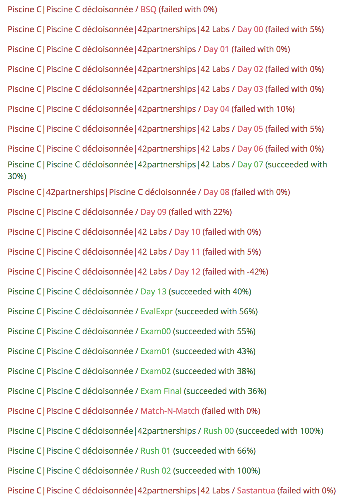

# École 42

## Piscine C

Every day for four weeks and even on weekends, we have to do exercises and
projects in C. This piscine starts from zero and does not ask for any prior
knowledge... apart from knowing how to use a mouse and a keyboard.

*Disclaimer: I've fixed a lot of the exercises, and made new solutions
to previous ones that I didn't completed during my piscine.
These scores don't show the final mark of this repository.*

### TODO

*Norminette files*

* BSQ
* Day09
	- ex15
	- ex21
* Day12
	- ex02
	- ex03
	- ex04
* Day13
	- ex07
	- ex08
	- ex09

### TOFIX

* Sudoku
	- Fix for multiple solutions
